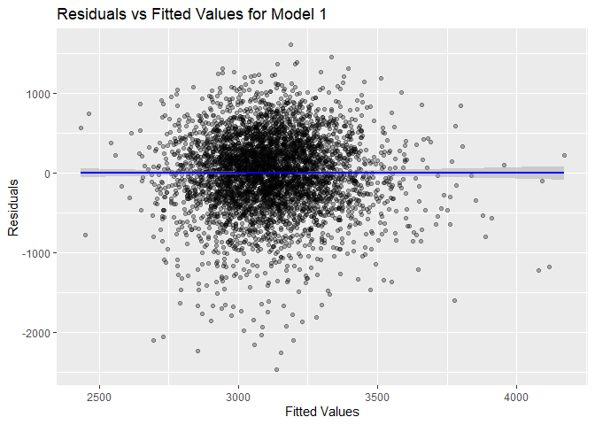

p8105_hw6_xl3495
================
Xueting Li
2024-12-01

``` r
library(tidyverse)
```

    ## ── Attaching core tidyverse packages ──────────────────────── tidyverse 2.0.0 ──
    ## ✔ dplyr     1.1.4     ✔ readr     2.1.5
    ## ✔ forcats   1.0.0     ✔ stringr   1.5.1
    ## ✔ ggplot2   3.5.1     ✔ tibble    3.2.1
    ## ✔ lubridate 1.9.3     ✔ tidyr     1.3.1
    ## ✔ purrr     1.0.2     
    ## ── Conflicts ────────────────────────────────────────── tidyverse_conflicts() ──
    ## ✖ dplyr::filter() masks stats::filter()
    ## ✖ dplyr::lag()    masks stats::lag()
    ## ℹ Use the conflicted package (<http://conflicted.r-lib.org/>) to force all conflicts to become errors

``` r
library(modelr)
library(broom)
```

    ## 
    ## Attaching package: 'broom'
    ## 
    ## The following object is masked from 'package:modelr':
    ## 
    ##     bootstrap

``` r
library(purrr)
set.seed(123)
```

# Problem 1

``` r
weather_df = 
  rnoaa::meteo_pull_monitors(
    c("USW00094728"),
    var = c("PRCP", "TMIN", "TMAX"), 
    date_min = "2017-01-01",
    date_max = "2017-12-31") %>%
  mutate(
    name = recode(id, USW00094728 = "CentralPark_NY"),
    tmin = tmin / 10,
    tmax = tmax / 10) %>%
  select(name, id, everything())
```

    ## using cached file: C:\Users\lxt03\AppData\Local/R/cache/R/rnoaa/noaa_ghcnd/USW00094728.dly

    ## date created (size, mb): 2024-12-02 05:01:50.627108 (8.685)

    ## file min/max dates: 1869-01-01 / 2024-11-30

``` r
n_bootstrap = 5000

boot_models = weather_df |>
  select(tmax, tmin) |>
  modelr::bootstrap(n = n_bootstrap) |>
    mutate(
    model = map(strap, ~ lm(tmax ~ tmin, data = .))
  )

boot_r_squared = boot_models |>
  mutate(glance = map(model, glance)) |>
  unnest(glance) |>
  select(r.squared) |>
   mutate(metric = "R-squared")


boot_coefficients = boot_models |>
  mutate(
    coefficients = map(model, coefficients),
    product = map_dbl(coefficients, ~ .[1] * .[2]),
    log_beta = log(product)
  ) |>
  select(log_beta) |>
  mutate(metric = "log(β0 * β1)")
```

``` r
combined_data = bind_rows(
  boot_r_squared |> rename(value = r.squared),
  boot_coefficients |> rename(value = log_beta)
)

ggplot(combined_data, aes(x = value, fill = metric)) +
  geom_histogram(bins = 30, alpha = 0.6) +
  facet_wrap(~ metric, scales = "free_x") +  # Facet by 'metric' variable
  theme_minimal() +
  scale_fill_manual(values = c("R-squared" = "lightblue", "log(β0 * β1)" = "lightgreen")) +
  labs(
    title = "Distribution of R-squared and log(β0 * β1) from Bootstrap Samples",
    x = "Value", y = "Frequency"
  )
```

<!-- -->
From the plot, the distributions of the two estimates follow an
approximate normal distribution. For $log(\beta_0 * \beta_1)$, it
frequently distributes between (2, 2.025). For, $r^2$,it frequently
distributes between (0.905, 0.915).

``` r
r_squared_ci = quantile(boot_r_squared$r.squared, probs = c(0.025, 0.975))

log_beta_ci = quantile(boot_coefficients$log_beta, probs = c(0.025, 0.975))

ci_df = data.frame(
  Metric = c("R-squared", "log(β0 * β1)"),
  Lower_bound = c(r_squared_ci[1], log_beta_ci[1]),
  Upper_bound = c(r_squared_ci[2], log_beta_ci[2])
)

print(ci_df)
```

    ##         Metric Lower_bound Upper_bound
    ## 1    R-squared   0.8945701   0.9271042
    ## 2 log(β0 * β1)   1.9641656   2.0583636

# Problem 2

``` r
homicide_data = read_csv("datasets/homicide-data.csv") |>
  mutate(
    city_state = paste(city, state, sep = ", "),
    homicide_solved = if_else(disposition == "Closed by arrest", 1, 0),
    victim_age = as.numeric(victim_age)
    ) |>
  filter(
    !city_state %in% c("Dallas, TX", "Phoenix, AZ", "Kansas City, MO", "Tulsa, AL"),
    victim_race %in% c("White", "Black"),
    !is.na(victim_age)
    )
```

    ## Rows: 52179 Columns: 12
    ## ── Column specification ────────────────────────────────────────────────────────
    ## Delimiter: ","
    ## chr (9): uid, victim_last, victim_first, victim_race, victim_age, victim_sex...
    ## dbl (3): reported_date, lat, lon
    ## 
    ## ℹ Use `spec()` to retrieve the full column specification for this data.
    ## ℹ Specify the column types or set `show_col_types = FALSE` to quiet this message.

    ## Warning: There was 1 warning in `mutate()`.
    ## ℹ In argument: `victim_age = as.numeric(victim_age)`.
    ## Caused by warning:
    ## ! NAs introduced by coercion

``` r
baltimore_data = homicide_data |>
  filter(city_state == "Baltimore, MD")

log_reg_model = glm(homicide_solved ~ victim_age + victim_sex + victim_race, 
                     data = baltimore_data, 
                     family = binomial)

model_summary = tidy(log_reg_model, conf.int = TRUE)

# Extract the estimate and confidence interval for victim_sex variable
sex_results = model_summary |>
  filter(term == "victim_sexMale")

odds_ratio = exp(sex_results$estimate)
lower_ci = exp(sex_results$conf.low)
upper_ci = exp(sex_results$conf.high)

result_table = tibble(
  Variable = "Male vs Female Victims",
  Odds_Ratio = odds_ratio,
  Lower_CI = lower_ci,
  Upper_CI = upper_ci
)

print(result_table)
```

    ## # A tibble: 1 × 4
    ##   Variable               Odds_Ratio Lower_CI Upper_CI
    ##   <chr>                       <dbl>    <dbl>    <dbl>
    ## 1 Male vs Female Victims      0.426    0.324    0.558

``` r
city_log_reg = homicide_data |>
  filter(
    victim_sex %in% c("Male", "Female"), victim_race %in% c("White", "Black")
    ) |>
  group_by(city) |>
  nest() |>
  mutate(
    model = map(data, ~ glm(homicide_solved ~ victim_age + victim_sex + victim_race, 
                            data = ., family = binomial)),
    tidy_results = map(model, tidy, conf.int = TRUE)
  )


city_or_results = city_log_reg |>
  unnest(tidy_results) |>
  filter(term == "victim_sexMale") |>
  mutate(
    odds_ratio = exp(estimate),
    lower_ci = exp(conf.low),
    upper_ci = exp(conf.high)
  ) |>
  select(city, odds_ratio, lower_ci, upper_ci) |>
  arrange(desc(odds_ratio))

head(city_or_results)
```

    ## # A tibble: 6 × 4
    ## # Groups:   city [6]
    ##   city        odds_ratio lower_ci upper_ci
    ##   <chr>            <dbl>    <dbl>    <dbl>
    ## 1 Albuquerque       1.77    0.825     3.76
    ## 2 Stockton          1.35    0.626     2.99
    ## 3 Fresno            1.34    0.567     3.05
    ## 4 Nashville         1.03    0.681     1.56
    ## 5 Richmond          1.01    0.483     1.99
    ## 6 Atlanta           1.00    0.680     1.46

``` r
ggplot(city_or_results, aes(x = reorder(city, odds_ratio), 
                            y = odds_ratio, 
                            ymin = lower_ci, 
                            ymax = upper_ci)) +
  geom_point() + 
  geom_errorbar(width = 0.3) +
  coord_flip() +
  labs(
    title = "Adjusted Odds Ratio for Solving Homicides: Male vs Female Victims by City",
    x = "City",
    y = "Adjusted Odds Ratio (Male vs Female)"
  ) +
  theme_minimal()
```

<!-- -->

According to the plot, if the point is above 1, it suggests that male
victims have a higher likelihood of having their homicide solved
compared to female victims in that city, and if the CI includes 1, the
effect is not statistically significant, meaning we cannot conclude
whether there’s a difference in the likelihood of solving homicides for
male vs. female victims in that city. For example, male victims in
Albuquerque have a higher likelihood of having their homicide solved
compared to female victims. There are still a number of cities we cannot
conclude whether there’s a difference in the likelihood of solving
homicides for male vs. female victims.

# Problem 3

``` r
bw_data = read_csv("datasets/birthweight.csv") |>
  mutate(
    babysex = factor(babysex, levels = c(1, 2), labels = c("Male", "Female")),
    frace = factor(frace, levels = c(1, 2, 3, 4, 8, 9),
                   labels = c("White", "Black", "Asian", "Puerto Rican", "Other", "Unknown")),
    mrace = factor(mrace, levels = c(1, 2, 3, 4, 8),
                   labels = c("White", "Black", "Asian", "Puerto Rican", "Other")),
    malform = factor(malform, levels = c(0, 1), labels = c("Absent", "Present"))
  ) |>
  na.omit()
```

    ## Rows: 4342 Columns: 20
    ## ── Column specification ────────────────────────────────────────────────────────
    ## Delimiter: ","
    ## dbl (20): babysex, bhead, blength, bwt, delwt, fincome, frace, gaweeks, malf...
    ## 
    ## ℹ Use `spec()` to retrieve the full column specification for this data.
    ## ℹ Specify the column types or set `show_col_types = FALSE` to quiet this message.

``` r
summary(bw_data)
```

    ##    babysex         bhead          blength           bwt           delwt      
    ##  Male  :2230   Min.   :21.00   Min.   :20.00   Min.   : 595   Min.   : 86.0  
    ##  Female:2112   1st Qu.:33.00   1st Qu.:48.00   1st Qu.:2807   1st Qu.:131.0  
    ##                Median :34.00   Median :50.00   Median :3132   Median :143.0  
    ##                Mean   :33.65   Mean   :49.75   Mean   :3114   Mean   :145.6  
    ##                3rd Qu.:35.00   3rd Qu.:51.00   3rd Qu.:3459   3rd Qu.:157.0  
    ##                Max.   :41.00   Max.   :63.00   Max.   :4791   Max.   :334.0  
    ##     fincome               frace         gaweeks         malform    
    ##  Min.   : 0.00   White       :2123   Min.   :17.70   Absent :4327  
    ##  1st Qu.:25.00   Black       :1911   1st Qu.:38.30   Present:  15  
    ##  Median :35.00   Asian       :  46   Median :39.90                 
    ##  Mean   :44.11   Puerto Rican: 248   Mean   :39.43                 
    ##  3rd Qu.:65.00   Other       :  14   3rd Qu.:41.10                 
    ##  Max.   :96.00   Unknown     :   0   Max.   :51.30                 
    ##     menarche        mheight          momage              mrace     
    ##  Min.   : 0.00   Min.   :48.00   Min.   :12.0   White       :2147  
    ##  1st Qu.:12.00   1st Qu.:62.00   1st Qu.:18.0   Black       :1909  
    ##  Median :12.00   Median :63.00   Median :20.0   Asian       :  43  
    ##  Mean   :12.51   Mean   :63.49   Mean   :20.3   Puerto Rican: 243  
    ##  3rd Qu.:13.00   3rd Qu.:65.00   3rd Qu.:22.0   Other       :   0  
    ##  Max.   :19.00   Max.   :77.00   Max.   :44.0                      
    ##      parity            pnumlbw     pnumsga      ppbmi            ppwt      
    ##  Min.   :0.000000   Min.   :0   Min.   :0   Min.   :13.07   Min.   : 70.0  
    ##  1st Qu.:0.000000   1st Qu.:0   1st Qu.:0   1st Qu.:19.53   1st Qu.:110.0  
    ##  Median :0.000000   Median :0   Median :0   Median :21.03   Median :120.0  
    ##  Mean   :0.002303   Mean   :0   Mean   :0   Mean   :21.57   Mean   :123.5  
    ##  3rd Qu.:0.000000   3rd Qu.:0   3rd Qu.:0   3rd Qu.:22.91   3rd Qu.:134.0  
    ##  Max.   :6.000000   Max.   :0   Max.   :0   Max.   :46.10   Max.   :287.0  
    ##      smoken           wtgain      
    ##  Min.   : 0.000   Min.   :-46.00  
    ##  1st Qu.: 0.000   1st Qu.: 15.00  
    ##  Median : 0.000   Median : 22.00  
    ##  Mean   : 4.145   Mean   : 22.08  
    ##  3rd Qu.: 5.000   3rd Qu.: 28.00  
    ##  Max.   :60.000   Max.   : 89.00

## Model1: delwt + momage + ppbmi

``` r
model1 = lm(bwt ~ delwt + momage + ppbmi, data = bw_data)
summary(model1)
```

    ## 
    ## Call:
    ## lm(formula = bwt ~ delwt + momage + ppbmi, data = bw_data)
    ## 
    ## Residuals:
    ##      Min       1Q   Median       3Q      Max 
    ## -2458.17  -274.76    24.42   310.03  1604.02 
    ## 
    ## Coefficients:
    ##              Estimate Std. Error t value Pr(>|t|)    
    ## (Intercept) 2107.2974    62.7384   33.59   <2e-16 ***
    ## delwt         10.4698     0.4726   22.15   <2e-16 ***
    ## momage        16.1003     1.8830    8.55   <2e-16 ***
    ## ppbmi        -39.1198     3.3001  -11.85   <2e-16 ***
    ## ---
    ## Signif. codes:  0 '***' 0.001 '**' 0.01 '*' 0.05 '.' 0.1 ' ' 1
    ## 
    ## Residual standard error: 479.4 on 4338 degrees of freedom
    ## Multiple R-squared:  0.1244, Adjusted R-squared:  0.1238 
    ## F-statistic: 205.5 on 3 and 4338 DF,  p-value: < 2.2e-16

``` r
model1 |>
  broom::tidy()
```

    ## # A tibble: 4 × 5
    ##   term        estimate std.error statistic   p.value
    ##   <chr>          <dbl>     <dbl>     <dbl>     <dbl>
    ## 1 (Intercept)   2107.     62.7       33.6  4.65e-220
    ## 2 delwt           10.5     0.473     22.2  4.12e-103
    ## 3 momage          16.1     1.88       8.55 1.68e- 17
    ## 4 ppbmi          -39.1     3.30     -11.9  6.34e- 32

``` r
bw_data |>
  add_predictions(model1) |>
  add_residuals(model1) |>
  ggplot(aes(x = pred, y = resid)) +
  geom_point(alpha = 0.3) +
  geom_smooth(method = "lm", color = "blue") +
  labs(x = "Fitted Values", y = "Residuals", 
       title = "Residuals vs Fitted Values for Model 1")
```

    ## `geom_smooth()` using formula = 'y ~ x'

<!-- -->

The modeling process involves building a linear regression model to
predict birthweight (bwt) based on several predictor variables. In this
case, I am using the following variables:

`delwt`: Mother’s weight at delivery (in pounds)  
`momage`: Mother’s age at delivery (in years)  
`ppbmi`: Mother’s pre-pregnancy BMI

This model aims to predict the birthweight (bwt) using these predictors,
based on a linear relationship. After summarizing the model with
summary() and broom::tidy(), I used add_predictions() and
add_residuals() to compute predicted values and residuals.

## Model2: blength + gaweeks

``` r
model2 = lm(bwt ~ blength + gaweeks, data = bw_data)
summary(model2)
```

    ## 
    ## Call:
    ## lm(formula = bwt ~ blength + gaweeks, data = bw_data)
    ## 
    ## Residuals:
    ##     Min      1Q  Median      3Q     Max 
    ## -1709.6  -215.4   -11.4   208.2  4188.8 
    ## 
    ## Coefficients:
    ##              Estimate Std. Error t value Pr(>|t|)    
    ## (Intercept) -4347.667     97.958  -44.38   <2e-16 ***
    ## blength       128.556      1.990   64.60   <2e-16 ***
    ## gaweeks        27.047      1.718   15.74   <2e-16 ***
    ## ---
    ## Signif. codes:  0 '***' 0.001 '**' 0.01 '*' 0.05 '.' 0.1 ' ' 1
    ## 
    ## Residual standard error: 333.2 on 4339 degrees of freedom
    ## Multiple R-squared:  0.5769, Adjusted R-squared:  0.5767 
    ## F-statistic:  2958 on 2 and 4339 DF,  p-value: < 2.2e-16

``` r
bw_data |>
  add_predictions(model2) |>
  add_residuals(model2) |>
  ggplot(aes(x = pred, y = resid)) +
  geom_point(alpha = 0.3) +
  geom_smooth(method = "lm", color = "blue") +
  labs(x = "Fitted Values", y = "Residuals", 
       title = "Residuals vs Fitted Values for Model 2")
```

    ## `geom_smooth()` using formula = 'y ~ x'

<!-- -->

## Model3: bhead \* blength \* babysex

``` r
model3 = lm(bwt ~ bhead * blength * babysex, data = bw_data)
summary(model3)
```

    ## 
    ## Call:
    ## lm(formula = bwt ~ bhead * blength * babysex, data = bw_data)
    ## 
    ## Residuals:
    ##      Min       1Q   Median       3Q      Max 
    ## -1132.99  -190.42   -10.33   178.63  2617.96 
    ## 
    ## Coefficients:
    ##                               Estimate Std. Error t value Pr(>|t|)    
    ## (Intercept)                 -7176.8170  1264.8397  -5.674 1.49e-08 ***
    ## bhead                         181.7956    38.0542   4.777 1.84e-06 ***
    ## blength                       102.1269    26.2118   3.896 9.92e-05 ***
    ## babysexFemale                6374.8684  1677.7669   3.800 0.000147 ***
    ## bhead:blength                  -0.5536     0.7802  -0.710 0.478012    
    ## bhead:babysexFemale          -198.3932    51.0917  -3.883 0.000105 ***
    ## blength:babysexFemale        -123.7729    35.1185  -3.524 0.000429 ***
    ## bhead:blength:babysexFemale     3.8781     1.0566   3.670 0.000245 ***
    ## ---
    ## Signif. codes:  0 '***' 0.001 '**' 0.01 '*' 0.05 '.' 0.1 ' ' 1
    ## 
    ## Residual standard error: 287.7 on 4334 degrees of freedom
    ## Multiple R-squared:  0.6849, Adjusted R-squared:  0.6844 
    ## F-statistic:  1346 on 7 and 4334 DF,  p-value: < 2.2e-16

``` r
bw_data |>
  add_predictions(model3) |>
  add_residuals(model3) |>
  ggplot(aes(x = pred, y = resid)) +
  geom_point(alpha = 0.3) +
  geom_smooth(method = "lm", color = "blue") +
  labs(x = "Fitted Values", y = "Residuals", 
       title = "Residuals vs Fitted Values for Model 3")
```

    ## `geom_smooth()` using formula = 'y ~ x'

<!-- -->

## Cross Validation

``` r
cv_df = crossv_mc(bw_data, n = 100, test = 0.2) |>
  mutate(
    model1  = map(train, \(df) lm(bwt ~ delwt + momage + ppbmi, data = bw_data)),
    model2  = map(train, \(df) lm(bwt ~ blength + gaweeks, data = bw_data)),
    model3 = map(train, \(df) lm(bwt ~ bhead * blength * babysex, data = bw_data))
  ) |>
   mutate(
    rmse_model1 = map2_dbl(model1, test, ~rmse(model = .x, data = .y)),
    rmse_model2 = map2_dbl(model2, test, ~rmse(model = .x, data = .y)),
    rmse_model3 = map2_dbl(model3, test, ~rmse(model = .x, data = .y))
  )

cv_df |> 
  summarise(model1_mean_error = mean(rmse_model1),
            model2_mean_error = mean(rmse_model2),
            model3_mean_error = mean(rmse_model3)) |>
  knitr::kable(digits = 3)
```

| model1_mean_error | model2_mean_error | model3_mean_error |
|------------------:|------------------:|------------------:|
|            479.17 |           333.302 |           288.252 |

``` r
cv_long = cv_df |>
  pivot_longer(cols = starts_with("rmse_model"), 
               names_to = "model", 
               values_to = "rmse")

ggplot(cv_long, aes(x = model, y = rmse, fill = model)) +
  geom_violin(trim = FALSE) + 
  labs(
    title = "Cross Validation: RMSE Distribution",
    x = "Model",
    y = "RMSE"
  ) +
  scale_fill_brewer(palette = "Set3") + 
  theme_minimal() +
  theme(axis.text.x = element_text(angle = 45, hjust = 1))
```

<!-- -->

My model shows poorest performance in predicting birthweight with the
highest mean squared error, but model 3 has a good performance among the
three with lowest mse.
